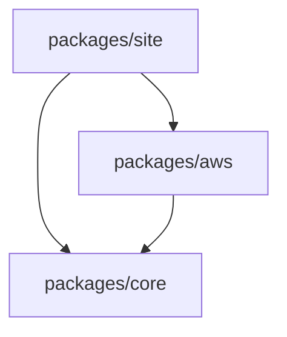

# Development Guide: React Icons Cloud

This document explains the architecture of the **React Icons Cloud** monorepo and provides instructions on how to extend it.

---

## 🏗️ Monorepo Architecture

The project uses **npm workspaces** to manage multiple packages in a single repository.

### Package Structure
- **`packages/core`**: The engine of the library. It contains the `IconBase` component and `IconContext`. All icons in other packages wrap around `IconBase`.
- **`packages/aws`**: A collection of AWS-specific icons. It depends on `@react-icons-cloud/core`.
- **`packages/site`**: A Next.js application (using Turbopack) that serves as the documentation and playground for the icons.

### Dependency Flow


---

## 🎨 How to Add New Icons

There are two ways to add icons to a package like `packages/aws`:

### 1. Manual Method (Standard)
1. Create a new file in `packages/aws/src/icons/YourIconName.tsx`.
2. Follow this template:
```tsx
import { IconBase, IconBaseProps, IconType } from "@react-icons-cloud/core";
import React from "react";

export const YourIconName: IconType = React.forwardRef<SVGSVGElement, IconBaseProps>((props, ref) => (
  <IconBase ref={ref} {...props}>
    {/* Your SVG paths here */}
    <path d="..." />
  </IconBase>
));

YourIconName.displayName = "YourIconName";
```
3. Export the icon in `packages/aws/src/index.ts`.
4. Run `npm run build` in the package directory to compile it.

### 2. Automated Method (Recommended)
The project includes a script to generate icons from raw SVG files.
1. Place your `.svg` files in `svg-sources/aws/`.
2. Run the generation script (if configured) or use the existing `scripts/generate-icons.ts`.
3. The script will optimize the SVG (removing hardcoded colors/sizes) and generate the `.tsx` component automatically.

---

## 🧠 Understanding SVG Paths
Example: `<path d="M12 2 2 7l10 5 10-5z" />`

This path uses **shorthand commands**:
- **`M12 2`**: (Move) Start at coordinate X=12, Y=2.
- **`2 7`**: (Implicit Absolute Line) Draw a line to X=2, Y=7.
- **`l10 5`**: (Relative Line) Move right 10 and down 5 from current position (ends at X=12, Y=12).
- **`10-5`**: (Implicit Relative Line) Move right 10 and up 5 (ends at X=22, Y=7).
- **`z`**: (Close) Draw a line back to the start (12, 2).

This creates a **diamond / rhombus** shape which serves as the top face of many cloud service icons.

---

## 🚀 Working Model: From Zero to Site

1. **Install Dependencies**: `npm install` at the root.
2. **Compile Core**: `npm run build -w @react-icons-cloud/core`.
3. **Compile Icons**: `npm run build -w @react-icons-cloud/aws`.
4. **Launch Site**: `npm run dev -w site`.
5. **Update Icons**: Changes to icons require a rebuild of the package (`aws` or `core`) before the `site` sees them, unless using a live-linking tool.
